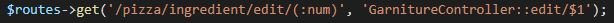
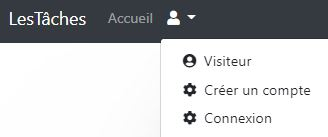

# C'est quoi CodeIgniter ?

CodeIgniter est un framework écrit en PHP open source créer par EllisLab (une société de logiciels américaine) sortie en février 2006. Son principal objectif est de permettre aux développeurs de créer des site web plus facilement et plus rapide. En ce moment, on travaille avec la version 4 du CodeIgniter.

# Préparer l'environnement
Afin que le site web fonctionnne correctement, il y a quelques chose à préparer  
### .env & création base de données
Premièrement, il faut configurer le fichier **.env**. Voici la configuration :  
  
  
Dans mon cas, ma base de données est appeller **dbTodo**. 
Maintenant qu'on a dit quel base de données CodeIgniter doit utiliser, il faut la créer. On y va dans le terminal et on saisie `` $ mysql -u root -p 
`` pour se connecter (il faut saisir le mot de passe).  
Ensuite, on saisie ``$ create database <nom_base_de_données>`` (sans les < >) pour créer la base de données.
### Migration
Avant de faire les migrations, il faut faire un ``$ composer update`` pour récupérer le **vendor** et avoir accès à la création des tables Myth/Auth. 
Pour faire les migrations, on saisie dans le terminal ``$ php spark migrate --all`` pour les exécuter et donc créer les tables nécessaires dans la base de données (ici on a les tables du *myth/auth* et la table *task*)  
### Seeder
Pour ne pas créer les utilisateurs, groupes, tâches, etc, j'ai créer 3 seeders pour que toutes ces choses sont créer automatiquement. Les seeders doivent être exécuter dans un certain ordre sinon ça fonctionne pas. Voici l'ordre :  
1) AdminUserSeeder (création d'un admin et de 2 utilisateurs)  
2) GroupUser (création d'un groupe admin et d'un groupe utilisateur + association d'un utilisateur dans un groupe)  
3) TaskSeeder (création des tâches pour les 2 utilisateurs)  

Pour avoir accès aux identifiants des utilisateurs et de l'admin, il faut aller dans **app/Database/Seeds/AdminUserSeeder.php**

Pour exécuter un seeder on saisie ``$ php spark db:seed nom_seeder``
### Attention
**Les seeders ne vont pas fonctionner si vous avez créer déjà un groupe,utilisateur,etc. Comme les *id* sont en auto_increment, si vous avez créer un groupe,etc, le prochain *id* sera 2 et pas 1. Les seeders ont été créer avec l'idée qu'il a eu aucune modification sur la base de données. Dans le cas où 1 groupe/utilisateur a été créer, pour ne pas recréer une autre base de données, on peut saisir ``alter table nom_table auto_increment = 0;`` pour que le auto_increment recommencera à 0**. 

# La structure du CodeIgniter
CodeIgniter utilise une structur qui s'appelle **Model View Controller (MVC)**. Le principe est de séparer le code de programme et le code de présentation.  
 
**Model →** Le **Model** signifie le modèle de données. Avec ceci, on peut consulter les données stockées dans la base de données ou les mettre à jour. Le **Model** propose plusieurs fonctions qui intéragir avec la base de données pour éviter de le faire nous même.  
**View →** Le **View** est la partie de l'application qui est présentée aux utilisateurs. Généralement, c'est du HTML dans lequel le contenu est intégré dynamiquement via PHP. On a aussi la possibilité de définir des éléments de la page comme l'en-tête (header) ou le pied de page (footet)  
**Controller →** Le **Controller** (contrôleur) sert comme lien entre le modèle, la vue et toute autre ressource qui est utilisé pour générer dynamiquement un site Web. Ce composant prend les demandes entrantes, valide l'entrée et sélectionne la vue souhaitée et transmet le contenu que le modèle de données a chargé à partir d'une base de données.  

# Code important/utile
### Fichier .env
  
Le fichier **.env** (et pas **env**), est le fichier qui contient le code pour se connecter à la base de données. Dans ce exemple, on se connecte en tant que **root** sur la base de données **dbTodo** sur **localhost**. Il doit être configurer avant de créer la base de données. 
  
Dans la phase de développement, c'est important de mettre la valeur de ce paramêtre à **development** (**production** par défaut). Ceci va nous permettre de visualer les erreurs produites par le site web et potentiellement les résoudre.  

### Fichier app/Config/Routes.php
  
Ce fichier va nous permettre de configurer les liens URL de notre site web.  
  
Premièrement on va définir quel page on va configurer (ici c'est **/pizzas**). Ensuite, on définit le contrôleur avec la fonctionne désiré. Dans notre exemple, quand on arrive sur la page **/pizzas**, le contrôleur **PizzaController** va appeller la fonctionne **index** qui est ici une page de présentation. Avec les **routes** en combinaison avec **AuthMyth** (une extension qui permet d'avoir des comptes et donc une connexion), on peut définir quels personnes peuvent accèder cette page.  
  
On peut voir que une fois qu'une personne arrive sur la page **/admin**, on va vérifier avec **filter** si cette personne fait partie du groupe **admin**. S'il ne fait pas partie de ce groupe, son accès sera réfuser.

### Fichier app/Controllers & Views
Comme son nom l'indique, les **Controllers** vont nous permettre de contrôler ce que chaque URL du site web affiche. Comme on a vu avant, on dans les **Routes** on peut définir le contrôleur utiliser ainsi que sa fonction. 
  
Un contrôleur est composé dans constructeur (**__construct**) ou on définir les données membres (si on veut importer un **Model** il faut le définir en dehours du contrôleur)  
  
De plus, on peut aussi définir les fonctions qu'on veut que ce contrôler possède. On peut voir que la fonction **index** va récupérer quelques données avec **$data[]** et va afficher la page **Garniture-index.php**. Pour définir les paramêtres (dans ce cas on a **$idPizza**), il faut aller dans les **Views** et consulter la page qu'on veut afficher.  
  
  

### Fichier app/Database/Migrations & Seeds
Ces 2 dossiers sont utiliser pour créer la base de données et insérer des données. Avec ça, on n'est plus obliger de aller dans mysql pour créer une table et l'alimenter avec des données.  
Dans **/Migrations** on peut créer une base qu'on va créer avec une fonction proposé par **spark**. Ceci est un outil qui propose de nombreuses fonctions.  
  
Dans **/Seeds** on peut ajouter des données dans la base de données qu'on choisi. 

# Composants logiciels à developper

## 1. Gérer les tâches
### Objectif 
**•** L'objectif est d'être capable qu'on utilisateur ajoute/modifier/supprime/fait une tâche et aussi réordonner ses propres tâches. 
### Cas Utilisation - Gérer les tâches

### Maquette - Gérer les tâches

### Enchaînement Textuel - Gérer les tâches 
**•** <i> **Visualer les tâches** </i>  
    1. On clique sur **Liste des tâches** dans la barre de navigation. 
 
**•** <i> **Ajouter une tâche** </i>  
    1. On clique sur le **+** bleu en bas de la page.  
    2. On décrit la tâche et on met un nombre pour définir son ordre parmi les autres tâches (plus petit le nombre, plus important) et on clique sur **Ajouter +**.  
 
**•** <i> **Modifier une tâche** </i>  
    1. On clique sur le bouton **bleu** de la tâche qu'on veut modifier  
    2. On modifier les données qu'on veut et on clique sur **Modifier**.  
 
**•** <i> **Supprimer une tâche** </i>  
    1. On clique sur le bouton **rouge**  
 
**•** <i> **Faire une tâche** </i>  
    1. On clique sur le bouton **gris** pour effectuer la tâche. Une fois que la tâche est faite, une ligne va apparaître à travers le texte de la tâche pour signifier qu'elle est fini.  
 
**•** <i> **Réordonner les tâches** </i>  
    1. On clique sur le bouton **Réordonner** pour afficher la page de réordonnancement.  
    2. On change l'odre des tâches (plus petit = plus important =>plus haut sur la liste des tâches).  
 

## 2. Connexion
### Objectif 
**•** L'objectif est qu'un visiteur a la possibilité de créer un compte et de se connecter pour pouvoir créer ses tâches. Pour les utilisateurs, il faut leur donner la possibilité de modifier ses identifiants ou redemander un nouveau mot de passe dans le cas d'un oublie.
### Cas Utilisation - Connexion

### Maquette - Connexion

### Enchaînement Textuel - Connexion 
** Pour tout qui a besoin d'une vérification par mail, il faut saisir dans le terminal ``$ maildev`` pour démarrer le serveur SMTP et reçevoir les mails.**  
**•** <i> **Création d'un compte** </i>  
    1. On clique sur l'icône **user** pour afficher le menu.  
    2. On clique sur **Créer un compte**.  
    3. On saisie les informations nécessaires  
    4. On y va sur **maildev** pour activer notre compte  
 
**•** <i> **Connexion sur le site** </i>  
    1. On clique sur l'icône **user** pour afficher le menu  
    2. On clique sur **Connexion**  
    3. On se connecte avec ses identifiants (il faut avoir un compte activé)  
 
**•** <i> **Demander un nouveau mot de passe** </i>  
    1. On clique sur **Mot de passe oublié** dans **Se connecter**. 
    2. On saisie l'adresse mail.  
    3. On y va sur **maildev** pour réinitialiser notre mot de passe.  
    4. On saisie notre nouveau mot de passe.  
 
**•** <i> **Modifier ses identifiants** </i>  
    1. On clique sur l'icône **user** pour afficher le menu  
    2. On clique sur **Modifier compte**  
    3. On modifier les identifiants nécessaires (adresse mail, nom d'utilisateur, mot de passe).  
 
## 3. Administration
### Objectif 
**•** L'objectif est que l'administrateur du site vois les tâches de toutes les utilisateurs. De plus, il doit être capable de les modifier ou les supprimer.
### Cas Utilisation - Administration

### Maquette - Administration

### Enchaînement Textuel - Administration 
**Pour accèder à toutes les tâches il faut être connecter en tant qu'admin.**
**•** <i> **Visualer toutes les tâches** </i>  
    1. On clique sur **Liste des tâches - ADMIN**.  
 
**•** <i> **Modifier toutes les tâches** </i>  
    1. On clique sur l'icône **bleu** pour modifier quel tâche on veut.  
 
**•** <i> **Supprimer toutes les tâches** </i>  
    1. On clique sur l'icône **rouge** pour supprime quel tâche on veut.  
 

montre le diagramme de classe → codeigniter4_authmyth + table task

