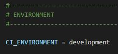

# C'est quoi CodeIgniter ?

CodeIgniter est un framework écrit en PHP open source créer par EllisLab (une société de logiciels américaine) sortie en février 2006. Son principal objectif est de permettre aux développeurs de créer des site web plus facilement et plus rapide. En ce moment, on travaille avec la version 4 du CodeIgniter.

# La structure du CodeIgniter
CodeIgniter utilise une structur qui s'appelle **Model View Controller (MVC)**. Le principe est de séparer le code de programme et le code de présentation.  
 
**Model →** Le **Model** signifie le modèle de données. Avec ceci, on peut consulter les données stockées dans la base de données ou les mettre à jour. Le **Model** propose plusieurs fonctions qui intéragir avec la base de données pour éviter de le faire nous même.  
**View →** Le **View** est la partie de l'application qui est présentée aux utilisateurs. Généralement, c'est du HTML dans lequel le contenu est intégré dynamiquement via PHP. On a aussi la possibilité de définir des éléments de la page comme l'en-tête (header) ou le pied de page (footet)  
**Controller →** Le **Controller** (contrôleur) sert comme lien entre le modèle, la vue et toute autre ressource qui est utilisé pour générer dynamiquement un site Web. Ce composant prend les demandes entrantes, valide l'entrée et sélectionne la vue souhaitée et transmet le contenu que le modèle de données a chargé à partir d'une base de données.  

# Code important/utile
### Fichier .env
  
Le fichier **.env** (et pas **env**), est le fichier qui contient le code pour se connecter à la base de données. Dans ce exemple, on se connecte en tant que **root** sur la base de données **dbTodo** sur **localhost**. Il doit être configurer avant de créer la base de données. 
  
Dans la phase de développement, c'est important de mettre la valeur de ce paramêtre à **development** (**production** par défaut). Ceci va nous permettre de visualer les erreurs produites par le site web et potentiellement les résoudre.  

### Fichier app/Config/Routes.php
  
Ce fichier va nous permettre de configurer les liens URL de notre site web.  
  
Premièrement on va définir quel page on va configurer (ici c'est **/pizzas**). Ensuite, on définit le contrôleur avec la fonctionne désiré. Dans notre exemple, quand on arrive sur la page **/pizzas**, le contrôleur **PizzaController** va appeller la fonctionne **index** qui est ici une page de présentation. Avec les **routes** en combinaison avec **AuthMyth** (une extension qui permet d'avoir des comptes et donc une connexion), on peut définir quels personnes peuvent accèder cette page.  
  
On peut voir que une fois qu'une personne arrive sur la page **/admin**, on va vérifier avec **filter** si cette personne fait partie du groupe **admin**. S'il ne fait pas partie de ce groupe, son accès sera réfuser.

### Fichier app/Database/Migrations & Seeds
Ces 2 dossiers sont utiliser pour créer la base de données et insérer des données. Avec ça, on n'est plus obliger de aller dans mysql pour créer une table et l'alimenter avec des données.  
Dans **/Migrations** on peut créer une base qu'on va créer avec une fonction proposé par **spark**. Ceci est un outil qui propose de nombreuses fonctions.  
  
Dans **/Seeds** on peut ajouter des données dans la base de données qu'on choisi. 

